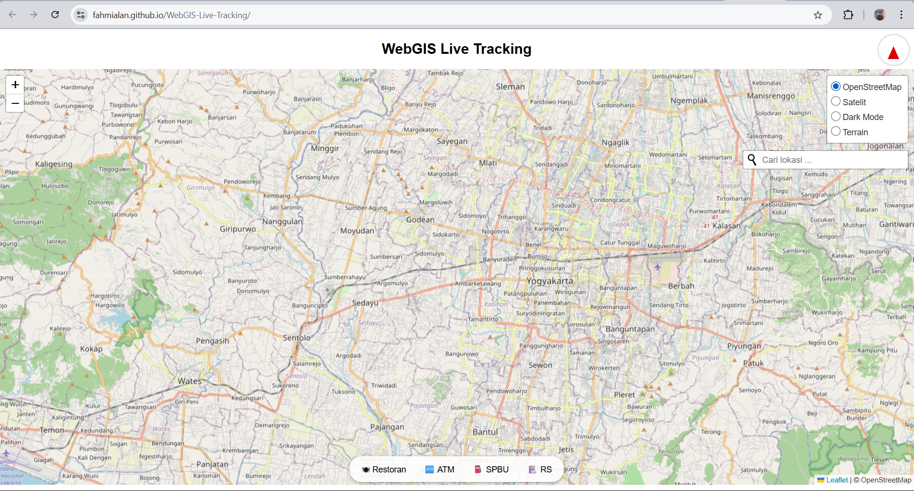

# 🌍 WebGIS-Live-Tracking

WebGIS-Live-Tracking adalah aplikasi peta interaktif berbasis Leaflet yang menampilkan:

* Lokasi pengguna secara langsung (live GPS)
* Jejak pergerakan (trace polyline)
* Arah hadap (kompas dinamis)
* Pencarian lokasi (Geocoder)
* Pencarian POI sekitar (Restoran, ATM, dll)
* Fitur **live tracking multi-user secara realtime** (saat dijalankan secara lokal dengan server Node.js)

---

## 🔧 Fitur Utama

| Fitur               | Keterangan                                                                              |
| ------------------- | --------------------------------------------------------------------------------------- |
| 🧭 Kompas Dinamis   | Menampilkan arah hadap pengguna (device orientation)                                    |
| 📍 Lokasi Real-time | Lokasi user ditampilkan dengan marker yang bisa digeser                                 |
| 🔵 Jejak Pergerakan | Setiap pergerakan membentuk jejak polyline                                              |
| 🔍 Pencarian Lokasi | Bisa cari tempat seperti "UPN Yogyakarta"                                               |
| 🗂 Pilih Basemap    | OSM, Satelit, Dark Mode, dan Terrain                                                    |
| 🏪 Kategori POI     | Tombol seperti ATM, RS, SPBU akan fetch data dari Overpass API                          |
| 🔄 Live Multi-User  | Menampilkan posisi pengguna lain secara realtime *(hanya saat dijalankan secara lokal)* |

---

## 🚀 Cara Menjalankan di Laptop Sendiri

### A. Versi Frontend (tanpa realtime)

Cocok jika hanya ingin demo peta, lokasi sendiri, dan fitur POI.

**Langkah:**

1. Clone repo:

   ```bash
   git clone https://github.com/FAHMIALAN/WebGIS-Live-Tracking.git
   ```
2. Buka folder proyek:

   ```bash
   cd WebGIS-Live-Tracking
   ```
3. Jalankan `index.html` dari folder `public` di browser (klik 2x atau pakai Live Server)

👍 Semua fitur frontend berjalan

🚫 Tidak ada fitur realtime antar pengguna

Dapat diliat pada gambar di bawah ini dimana tidak ada pin lokasi untuk menunjukan lokasi keberadaan user


---

### B. Versi Full (dengan Realtime Multi-User)

Butuh backend (`Node.js` + `socket.io`)

**Langkah:**

1. Install [Node.js](https://nodejs.org)
2. Masuk ke folder proyek:

   ```bash
   cd WebGIS-Live-Tracking
   ```
3. Install dependencies:

   ```bash
   npm install
   ```
4. Jalankan server:

   ```bash
   node server.js
   ```
5. Buka browser:

   ```
   http://localhost:3000
   ```
6. Jalankan di 2 tab/laptop untuk melihat fitur multi-user realtime 🚀

---

## 🌐 Kenapa Link GitHub Pages Tidak Menampilkan Realtime?

🔗 [https://fahmialan.github.io/WebGIS-Live-Tracking/](https://fahmialan.github.io/WebGIS-Live-Tracking/)

GitHub Pages **hanya mendukung file statis** (HTML, CSS, JS).
Fitur **live-tracking antar user membutuhkan backend WebSocket (Node.js + socket.io)**, yang **tidak didukung** oleh GitHub Pages.

| Fitur                       | Status di GitHub Pages        |
| --------------------------- | ----------------------------- |
| Peta, GPS, Kompas           | ✅ Berfungsi                   |
| Pencarian lokasi, POI       | ✅ Berfungsi                   |
| Live multi-user (socket.io) | ❌ Tidak didukung GitHub Pages |

📅 Solusi:

* Jalankan lokal dengan `node server.js`
* Atau deploy ke VPS / platform seperti Glitch, Render, Railway

---

## 📁 Struktur Folder Realtime

```
WEBGIS-REALTIME/
├── node_modules/
├── public/
│   ├── index.html
│   ├── script.js
│   ├── style.css
├── package.json
├── package-lock.json
├── README.md
├── server.js
```

---

## 👨‍💼 Author

**Fahmi Alan**
WebGIS Hobbyist & Developer
